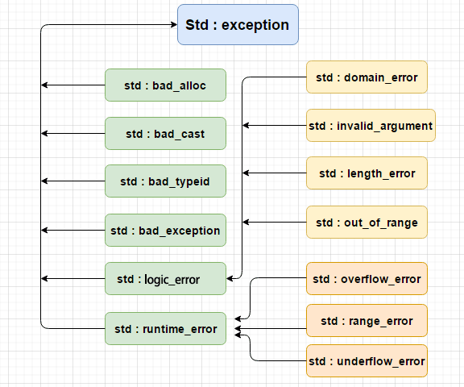

# 异常体系

C++中异常可以是任意类型。

C++ 中所有的异常类都继承自抽象类`exception`,该抽象类定义的唯一操作是一个名为`what`的虚成员，该虚函数返回`const char*`对象，一般用来异常处理方提取异常信息。

```c++
class exception
{
    public:
    exception() _GLIBCXX_USE_NOEXCEPT { }
    virtual ~exception() _GLIBCXX_TXN_SAFE_DYN _GLIBCXX_USE_NOEXCEPT;

    /** Returns a C-style character string describing the general cause
     *  of the current error.  */
    virtual const char*
    what() const _GLIBCXX_TXN_SAFE_DYN _GLIBCXX_USE_NOEXCEPT;
};
```

`exception`存在多个子类，主要为`logic_error`和`runtime_error`两个抽象类，这两个抽象类各自存在多个子类。


